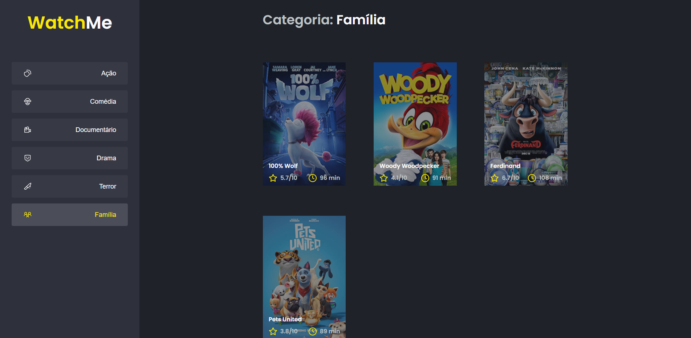

<h1 align="center">
    
</h1>

<br>

## 📺 WatchMe 

Watch Me é uma aplicação, onde você consegue listar filmes por categoria. 

A aplicação já está totalmente funcional mas grande parte do seu código está diretamente no arquivo `App.tsx`. Para resolver isso da melhor forma, foi necessário **componentizar** a aplicação.
 - Esta aplicação foi construida, durante o curso IGNITE da RocketSeat.

## 🛠 Tecnologias

Esse projeto foi desenvolvido com as seguintes tecnologias:

- ReactJS
- Typescript
- JSON Server
- Styled-components


## 🚀 Como executar

Clone o projeto e acesse a pasta do mesmo.

```bash
$ git clone git@github.com:luizsmatos/componentizando-a-aplicacao-reactjs.git
$ cd componentizando-a-aplicacao-reactjs
```

Para iniciá-lo, siga os passos abaixo:
```bash
# Instalar as dependências
$ yarn

# Iniciar o JSON Server
$ yarn server

# Iniciar o projeto
$ yarn dev
```
---
